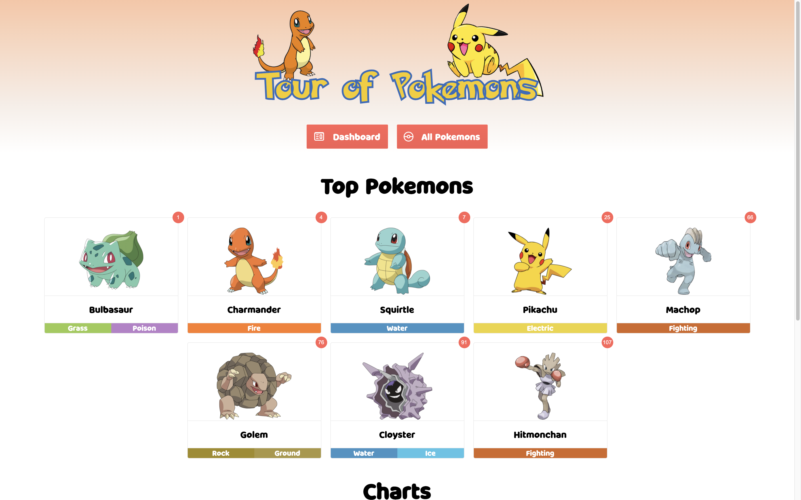

# Tour of Heroes — Pokemon Version

This is the Angular Tour of Heroes app with <b>Kendo UI</b> for Angular added in. I replaced the default heroes with Pokemons!

## Get the Code
```
git clone https://github.com/CelalCanKaya/angular-tour-of-heroes.git
npm i
```

## Development server

Run `ng serve` for a dev server. Navigate to `http://localhost:4200/`. The app will automatically reload if you change any of the source files.

## Used Kendo UI Components

* Kendo Card
* Kendo Pie Chart
* Kendo Textbox
* Kendo Dropdown List
* Kendo Dialog
* Kendo Button
* Kendo Badge
* Kendo Icon


## Screenshots




